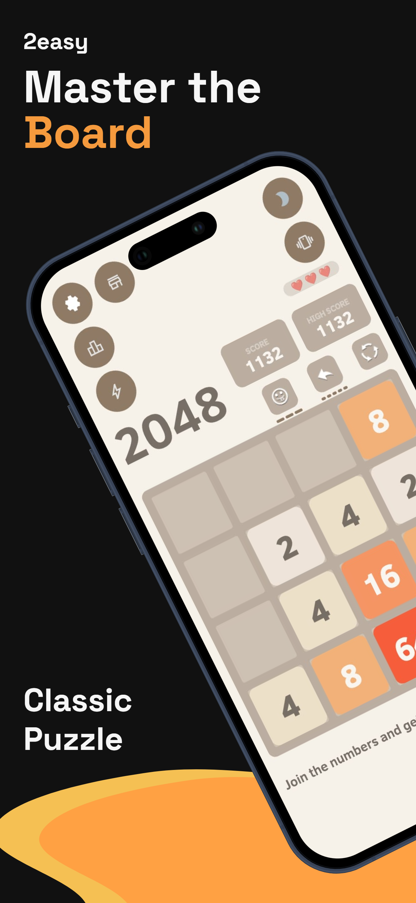
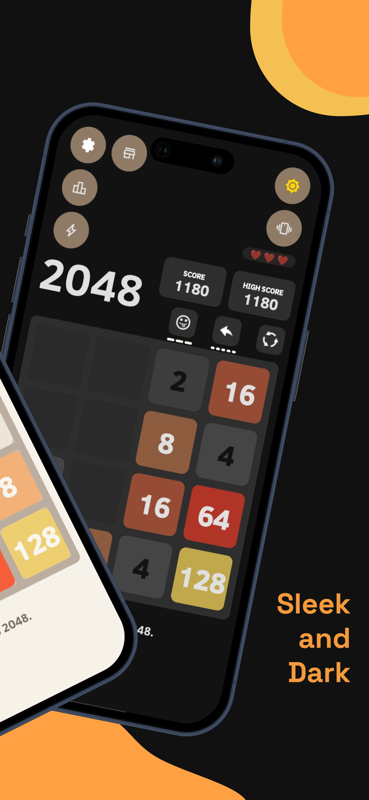

# 🎮 2048 for Android

A modern take on the classic **2048 puzzle**, built natively for Android with Java.

---

## 📱 About

**2048 for Android** is a native implementation of the classic 2048 puzzle game, written in Java.

The project started as my first Android game and grew beyond the original 4×4 experience with additional game modes, global leaderboards, themes, power-ups, custom animations, and Firebase-powered online features.

The goal of the project was not only to recreate 2048, but also to gain hands-on experience with Android development, game logic, UI/UX, animations, cloud services, and the process of building a complete mobile application.

---

## 📸 Screenshots

  
  
  
  
  

---

## ✨ Features

- 🎮 **Classic 2048 gameplay** with swipe controls and score tracking
- 🧩 **Multiple board sizes and game modes**
- ⚡ **Power-ups and lifelines**
- 🏆 **Global leaderboard** powered by Firebase
- 💾 **Local progress and high-score saving**
- 🌙 **Light and Dark themes**
- ✨ **Custom tile animations and visual effects**
- ⚙️ **Customizable game settings**
- 🔔 **Push notifications** with Firebase Cloud Messaging
- 📊 **Analytics and crash reporting**
- ☁️ **Firebase Remote Config**
- 📢 **Google AdMob integration**

---

## 🕹️ Game Modes

| Mode | Description |
|------|-------------|
| **Classic** | Traditional 4×4 2048 gameplay |
| **Time Attack** | Race against the clock and score as much as possible |
| **Big 5×5** | A larger board with more space and new strategies |
| **Extreme 6×6** | The largest board for long and high-scoring games |

---

## 🛠️ Tech Stack

| Technology | Usage |
|------------|-------|
| **Java** | Core application and game logic |
| **Android SDK** | Native Android development |
| **AndroidX** | Android application components |
| **ConstraintLayout** | Responsive UI layouts |
| **Firebase Realtime Database** | Global leaderboard and online data |
| **Firebase Cloud Messaging** | Push notifications |
| **Firebase Analytics** | Usage analytics |
| **Firebase Crashlytics** | Crash reporting |
| **Firebase Remote Config** | Remote application configuration |
| **Google AdMob** | In-app advertising |
| **Gradle Kotlin DSL** | Build configuration |

---

## 🧱 Project Structure

The project separates the core 2048 game logic from Android UI components.

Some of the main components include:

    com.ereke.qadam2048
    │
    ├── MainGame.java
    ├── MainView.java
    ├── Grid.java
    ├── Cell.java
    ├── Tile.java
    ├── AnimationGrid.java
    ├── AnimationCell.java
    │
    ├── LeaderboardActivity.java
    ├── LeaderboardAdapter.java
    ├── UserScore.java
    │
    ├── SettingsActivity.java
    └── MyFirebaseMessagingService.java

The game board, tiles, movement logic, animations, UI, leaderboard, and Firebase services are implemented as separate components.

---

## 🚀 Getting Started

### Requirements

- Android Studio
- Android SDK 35
- JDK compatible with the project's Android Gradle Plugin
- Android device or emulator running Android 9.0 (API 28) or newer

### 1. Clone the repository

    git clone https://github.com/YerbolatYerkhan/2048-game.git
    cd 2048-game

### 2. Open the project

Open the cloned directory in **Android Studio** and allow Gradle to synchronize the project.

### 3. Configure Firebase

The real `google-services.json` file is intentionally excluded from version control.

To use Firebase features:

1. Create or select a Firebase project.
2. Register the Android application.
3. Download your `google-services.json`.
4. Place it inside:

    app/google-services.json

A template configuration is included in the repository for reference.

### 4. Build and Run

Select an emulator or connected Android device and run the application from Android Studio.

---

## 🔐 Security

Sensitive project files are excluded from version control, including:

    google-services.json
    *.jks
    *.keystore
    *.apk
    *.aab

Private signing keys and production credentials should never be committed to the repository.

---

## 📜 Privacy Policy

The application's privacy policy is available here:

[Read the Privacy Policy](https://docs.google.com/document/d/10mp4N8yAxRxLo31uIsWS3eZZi4NmEOpMxe38kMUjsMU/edit)

---

## 📄 License

Copyright © 2026 **Yerbolatuly Yerkhan**. All rights reserved.

The source code in this repository is publicly available for viewing and portfolio purposes only.

No permission is granted to copy, modify, redistribute, sublicense, sell, or publish this project or its source code without explicit permission from the author.

---

## 👤 Author

**Yerbolatuly Yerkhan**

Developer: **2easy**  
GitHub: [@YerbolatYerkhan](https://github.com/YerbolatYerkhan)

---

Made while learning Android development and Java.

⭐ If you find the project interesting, consider giving the repository a star.

